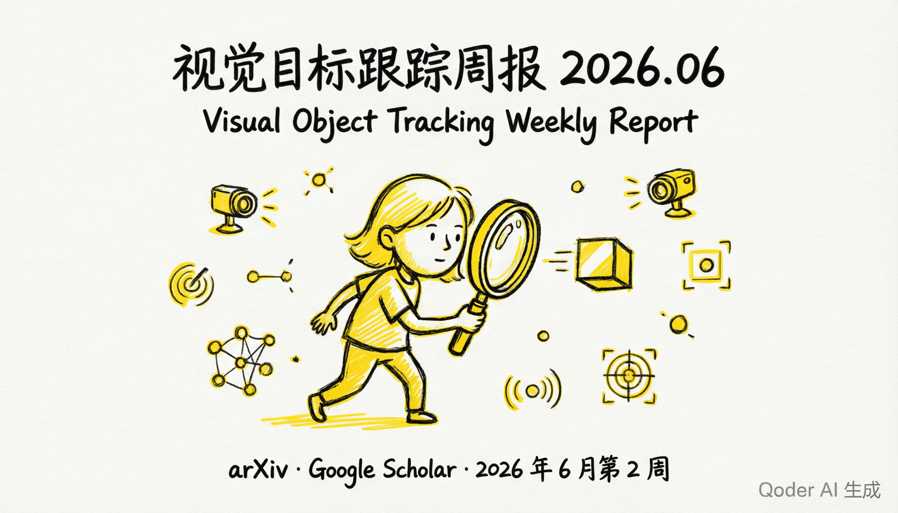
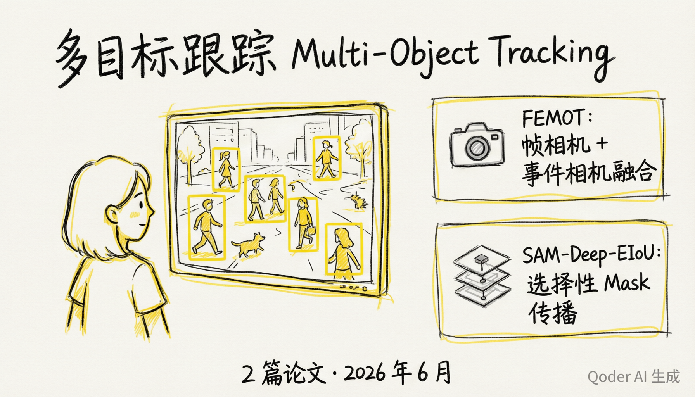
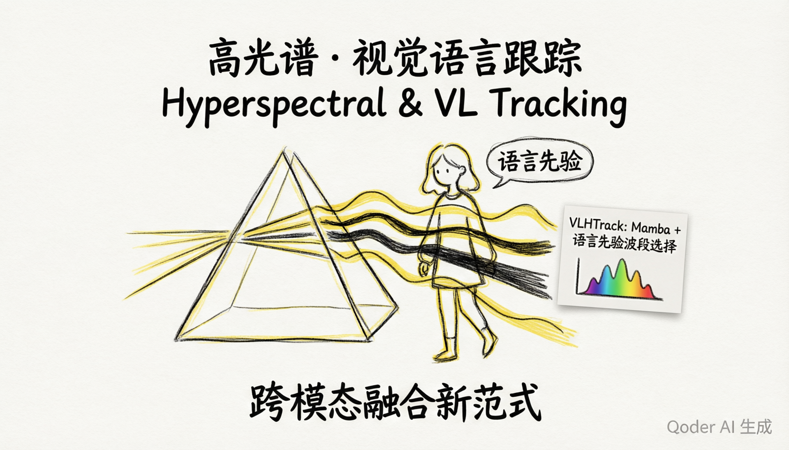
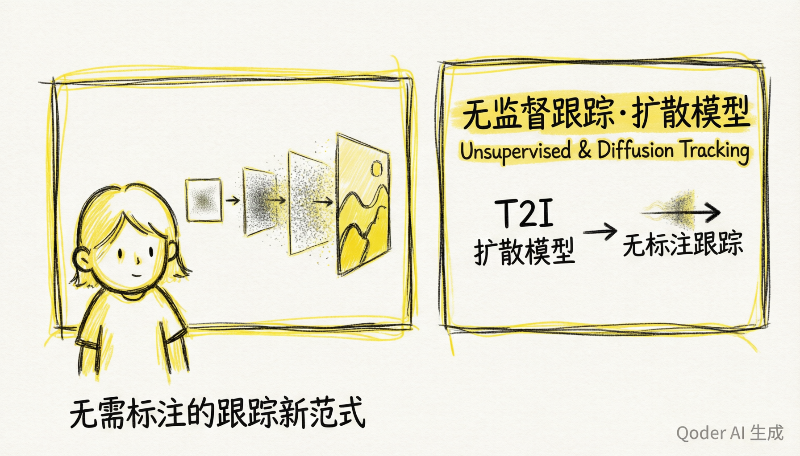
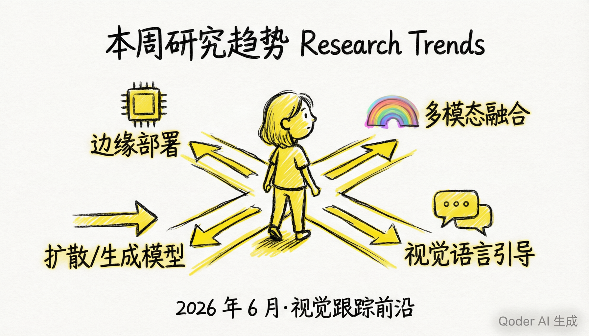

# Visual Tracking Papers

> A curated collection of recent academic papers on **Visual Object Tracking (VOT)**, updated weekly.
>
> 视觉目标跟踪（VOT）最新学术论文精选，每周更新。

**Covering / 覆盖方向:** Single Object Tracking (SOT) · Multi-Object Tracking (MOT) · 3D/4D Tracking · Multimodal Tracking (RGB-T, RGB-Event, Audio-Visual) · Edge Deployment · Datasets & Benchmarks

**Sources / 来源:** arXiv (cs.CV) · CVPR · ECCV · ICCV · NeurIPS · AAAI

---

## Latest Report / 最新报告

# Visual Object Tracking Weekly Report / 视觉目标跟踪周报

**Report Period / 报告周期:** 2026-06-10 ~ 2026-06-17

**Sources / 数据来源:** arXiv, Google Scholar, papers.cool

**Generated / 生成日期:** 2026-06-17

---

## Paper Summary Table / 论文汇总表

| No. / 序号 | Title (CN/EN) / 标题 | Authors / 作者 | Source / 来源 | Category / 方法类别 | Link / 链接 |
|---|---|---|---|---|---|
| 1 | FEMOT: Multi-Object Tracking using Frame and Event Cameras / FEMOT：基于帧相机与事件相机的多目标跟踪 | Shiao Wang, Xiao Wang, Chao Wang, Yitao Li, Menghao Liu, Bo Jiang, Yaowei Wang, Yonghong Tian, Jin Tang | arXiv 2606.14094 | 多目标跟踪 / Multi-Object Tracking | [arXiv](https://arxiv.org/abs/2606.14094) |
| 2 | SAM-Deep-EIoU: Selective Mask Propagation for Multi-Object Tracking / SAM-Deep-EIoU：面向多目标跟踪的选择性掩码传播 | Alexander Holmberg | arXiv 2606.13033 | 多目标跟踪 / Multi-Object Tracking | [arXiv](https://arxiv.org/abs/2606.13033) |
| 3 | VLHTrack: Vision-Language Guided Hyperspectral Object Tracking / VLHTrack：视觉语言引导的高光谱目标跟踪 | Rui Yao, Yuhong Zhang, Kunyang Sun, Hancheng Zhu, Jiaqi Zhao, Zhiwen Shao, Abdulmotaleb El Saddik | arXiv 2606.09167 | 高光谱与视觉语言跟踪 / Hyperspectral & VL Tracking | [arXiv](https://arxiv.org/abs/2606.09167) |
| 4 | KATANA: A Fast, Low-Power Mapping of Kalman Filters onto Edge NPUs for Real-Time Tracking / KATANA：面向实时跟踪的卡尔曼滤波器边缘NPU映射 | Bodhisatwa Kundu, Anish Rooj, Sumit Saha, Abhradeep Sarkar, Arghadip Das, Arnab Raha, Mrinal K. Naskar | arXiv 2606.14992 | 边缘部署与硬件加速 / Edge Deployment | [arXiv](https://arxiv.org/abs/2606.14992) |
| 5 | Leveraging Text-to-Image Diffusion Models for Unsupervised Visual Object Tracking / 利用文生图扩散模型实现无监督视觉目标跟踪 | Zhengbo Zhang, Zhigang Tu, Junsong Yuan, De Wen Soh, Bo Du | arXiv 2605.26933 | 无监督与扩散模型跟踪 / Unsupervised & Diffusion | [arXiv](https://arxiv.org/abs/2605.26933) |
| 6 | OneTrackerV2: Unified Multimodal Visual Tracking with Dual Mixture-of-Experts / OneTrackerV2：双混合专家统一多模态视觉跟踪 | Lingyi Hong, Jinglun Li, Xinyu Zhou, Kaixun Jiang, Pinxue Guo, Zhaoyu Chen, Runze Li, Xingdong Sheng, Wenqiang Zhang | arXiv 2605.03716 | 统一多模态跟踪 / Unified Multimodal | [arXiv](https://arxiv.org/abs/2605.03716) |
| 7 | HiT: Exploiting Lightweight Hierarchical ViT and Dynamic Framework for Efficient Visual Tracking / HiT：利用轻量层次化ViT与动态框架实现高效视觉跟踪 | Ben Kang, Xin Chen, Jie Zhao, Chunjuan Bo, Dong Wang, Huchuan Lu | arXiv 2506.20381 | 轻量高效跟踪 / Lightweight & Efficient | [arXiv](https://arxiv.org/abs/2506.20381) |
| 8 | Lightweight RGB-T Tracking with Mobile Vision Transformers / 基于移动视觉Transformer的轻量级RGB-T跟踪 | Mahdi Falaki, Maria A. Amer | arXiv 2506.19154 | 轻量高效跟踪 / Lightweight & Efficient | [arXiv](https://arxiv.org/abs/2506.19154) |
| 9 | Distractor-Aware Memory-Based Visual Object Tracking / 干扰感知的记忆增强视觉目标跟踪 | Jovana Videnovic, Matej Kristan, Alan Lukezic | arXiv 2509.13864 | 记忆增强与鲁棒跟踪 / Memory-based & Robust | [arXiv](https://arxiv.org/abs/2509.13864) |
| 10 | GOT-Edit: Geometry-Aware Generic Object Tracking via Online Model Editing / GOT-Edit：基于在线模型编辑的几何感知通用目标跟踪 | Shih-Fang Chen, Jun-Cheng Chen, I-Hong Jhuo, Yen-Yu Lin | arXiv 2602.08550 | 通用目标跟踪与3D / Generic & 3D Tracking | [arXiv](https://arxiv.org/abs/2602.08550) |

---

## Detailed Papers by Theme / 按主题分组的论文详情

---

### Theme 1: Multi-Object Tracking / 主题一：多目标跟踪

#### Paper 1 / 论文 1

**FEMOT: Multi-Object Tracking using Frame and Event Cameras**
**FEMOT：基于帧相机与事件相机的多目标跟踪**

- **Authors / 作者:** Shiao Wang, Xiao Wang, Chao Wang, Yitao Li, Menghao Liu, Bo Jiang, Yaowei Wang, Yonghong Tian, Jin Tang
- **Date / 日期:** 2026-06-12
- **Source / 来源:** arXiv 2606.14094
- **Link / 链接:** [arXiv](https://arxiv.org/abs/2606.14094)

[EN] Conventional RGB cameras have been widely used in multi-object tracking due to their ability to capture rich appearance and semantic information. However, their performance is often degraded under complex real-world challenges, such as motion blur, low illumination, and overexposure. This paper proposes FEMOT, a novel multi-object tracking framework that fuses frame cameras with event cameras to overcome these limitations. Event cameras capture asynchronous brightness changes at microsecond resolution, providing complementary temporal information that is robust to extreme lighting conditions.

[CN] 传统RGB相机因其丰富的外观和语义信息捕获能力而被广泛应用于多目标跟踪，但在运动模糊、低光照和过曝等复杂真实场景下性能往往下降。本文提出FEMOT，一种融合帧相机与事件相机的新型多目标跟踪框架。事件相机以微秒级分辨率捕获异步亮度变化，提供对极端光照条件鲁棒的互补时域信息。

- **Key Contributions / 关键技术贡献:**
  - Frame-event camera fusion for robust MOT / 帧-事件相机融合实现鲁棒多目标跟踪
  - Addresses motion blur and extreme illumination / 解决运动模糊和极端光照问题
  - Novel data association strategy leveraging event streams / 利用事件流的新型数据关联策略

---

#### Paper 2 / 论文 2

**SAM-Deep-EIoU: Selective Mask Propagation for Multi-Object Tracking**
**SAM-Deep-EIoU：面向多目标跟踪的选择性掩码传播**

- **Authors / 作者:** Alexander Holmberg (KTH Royal Institute of Technology)
- **Date / 日期:** 2026-06-11
- **Source / 来源:** arXiv 2606.13033
- **Link / 链接:** [arXiv](https://arxiv.org/abs/2606.13033)

[EN] Multi-object tracking has a heavy-tailed difficulty distribution: most frames are easy for a lightweight base tracker, while a small fraction are intrinsically hard. Video object segmentation (VOS) models can often preserve identity through the hard frames where the base tracker fails, but they are much more expensive in compute and memory. This paper proposes SAM-Deep-EIoU, which selectively invokes mask propagation only on the hard frames, achieving near-VOS quality at a fraction of the computational cost.

[CN] 多目标跟踪具有重尾难度分布：大部分帧对轻量级基础跟踪器来说很简单，而少数帧本质上很困难。视频目标分割（VOS）模型通常能在基础跟踪器失败的困难帧中保持身份一致性，但计算和内存开销远高于基础跟踪器。本文提出SAM-Deep-EIoU，仅在困难帧选择性调用掩码传播，以较低计算代价达到接近VOS的质量。

- **Key Contributions / 关键技术贡献:**
  - Heavy-tailed difficulty-aware selective VOS invocation / 基于重尾难度分布的选择性VOS调用
  - EIoU-based mask quality assessment / 基于EIoU的掩码质量评估
  - Near-VOS quality at base-tracker speed / 以基础跟踪器的速度达到接近VOS的质量

---

### Theme 2: Hyperspectral & Vision-Language Tracking / 主题二：高光谱与视觉语言跟踪

#### Paper 3 / 论文 3

**VLHTrack: Vision-Language Guided Hyperspectral Object Tracking via Semantics Fusion and Contextual Template Updating**
**VLHTrack：基于语义融合与上下文模板更新的视觉语言引导高光谱目标跟踪**

- **Authors / 作者:** Rui Yao, Yuhong Zhang, Kunyang Sun, Hancheng Zhu, Jiaqi Zhao, Zhiwen Shao, Abdulmotaleb El Saddik
- **Date / 日期:** 2026-06-08
- **Source / 来源:** arXiv 2606.09167
- **Link / 链接:** [arXiv](https://arxiv.org/abs/2606.09167)

[EN] Hyperspectral object tracking (HOT) leverages the rich spectral information provided by hyperspectral videos (HSVs), offering substantial potential for object tracking. However, efficiently extracting and exploiting spectral information from redundant spectral bands remains a fundamental challenge. This paper proposes VLHTrack, a novel hyperspectral vision-language (VL) joint tracking framework that uses language priors for informative band selection and employs Mamba architecture for efficient contextual template updating.

[CN] 高光谱目标跟踪（HOT）利用高光谱视频（HSV）提供的丰富光谱信息，在目标跟踪领域具有巨大潜力。然而，如何从冗余光谱波段中高效提取和利用光谱信息仍是根本性挑战。本文提出VLHTrack，一种新型高光谱视觉-语言（VL）联合跟踪框架，利用语言先验进行信息性波段选择，并采用Mamba架构实现高效的上下文模板更新。

- **Key Contributions / 关键技术贡献:**
  - Language priors for adaptive spectral band selection / 语言先验驱动的自适应光谱波段选择
  - Mamba-based contextual template updating / 基于Mamba的上下文模板更新
  - First VL-guided hyperspectral tracking framework / 首个视觉语言引导的高光谱跟踪框架

---

### Theme 3: Edge Deployment & Hardware Acceleration / 主题三：边缘部署与硬件加速

#### Paper 4 / 论文 4

**KATANA: A Fast, Low-Power Mapping of Kalman Filters onto Edge NPUs for Real-Time Tracking**
**KATANA：面向实时跟踪的卡尔曼滤波器边缘NPU快速低功耗映射**

- **Authors / 作者:** Bodhisatwa Kundu, Anish Rooj, Sumit Saha, Abhradeep Sarkar, Arghadip Das, Arnab Raha, Mrinal K. Naskar
- **Date / 日期:** 2026-06-12
- **Source / 来源:** arXiv 2606.14992
- **Link / 链接:** [arXiv](https://arxiv.org/abs/2606.14992)

[EN] State estimation is the closed-loop core of every real-time tracking system, from radar surveillance and counter-UAV defense to autonomous driving and robotics. This paper presents KATANA, an NPU-aware optimization framework delivering the first end-to-end mapping of the Linear Kalman Filter (LKF) and Extended Kalman Filter (EKF) onto a commercial NPU. KATANA applies three algebraic graph rewrites: subtract-to-add reformulation via a precomputed negative-projection matrix, static-shape tensor fusion, and block-diagonal batched parallelization, so that 100% of operations execute on the Data Processing Unit (DPU) matrix engine.

[CN] 状态估计是每一个实时跟踪系统的闭环核心，从雷达监视、反无人机防御到自动驾驶和机器人。本文提出KATANA，一种NPU感知的优化框架，首次实现线性卡尔曼滤波器（LKF）和扩展卡尔曼滤波器（EKF）在商用NPU上的端到端映射。KATANA采用三种代数图重写策略：基于预计算负投影矩阵的减法转加法、静态形状张量融合和块对角批量并行化，使100%的运算在数据处理单元（DPU）矩阵引擎上执行。

- **Key Contributions / 关键技术贡献:**
  - First end-to-end Kalman Filter mapping on commercial NPU / 首个商用NPU上的卡尔曼滤波器端到端映射
  - Three algebraic graph rewrite optimizations / 三种代数图重写优化策略
  - 100% DPU execution rate for state estimation / 状态估计100% DPU执行率

---

### Theme 4: Unsupervised & Diffusion-Based Tracking / 主题四：无监督与基于扩散模型的跟踪

#### Paper 5 / 论文 5

**Leveraging Text-to-Image Diffusion Models for Unsupervised Visual Object Tracking**
**利用文生图扩散模型实现无监督视觉目标跟踪**

- **Authors / 作者:** Zhengbo Zhang, Zhigang Tu, Junsong Yuan, De Wen Soh, Bo Du
- **Date / 日期:** 2026-05-26
- **Source / 来源:** arXiv 2605.26933
- **Link / 链接:** [arXiv](https://arxiv.org/abs/2605.26933)

[EN] Unsupervised visual object tracking is a challenging task that requires following arbitrary targets in videos without training on ground-truth annotations. This paper proposes a novel approach that leverages pretrained text-to-image (T2I) diffusion models as a generative prior for tracking. By exploiting the cross-attention maps within the diffusion denoising process, the method can localize and track objects without any labeled training data, establishing a new paradigm for annotation-free tracking.

[CN] 无监督视觉目标跟踪是一项具有挑战性的任务，需要在不使用真值标注训练的情况下跟踪视频中的任意目标。本文提出一种新方法，利用预训练的文生图（T2I）扩散模型作为跟踪的生成先验。通过利用扩散去噪过程中的交叉注意力图，该方法能够在无任何标注训练数据的情况下定位和跟踪目标，为无标注跟踪建立了新范式。

- **Key Contributions / 关键技术贡献:**
  - T2I diffusion models as tracking generative prior / T2I扩散模型作为跟踪生成先验
  - Cross-attention based object localization without labels / 基于交叉注意力的无标签目标定位
  - New paradigm for annotation-free tracking / 无标注跟踪新范式

---

### Theme 5: Unified Multimodal Tracking / 主题五：统一多模态跟踪

#### Paper 6 / 论文 6

**OneTrackerV2: Unified Multimodal Visual Tracking with Dual Mixture-of-Experts**
**OneTrackerV2：基于双混合专家的统一多模态视觉跟踪**

- **Authors / 作者:** Lingyi Hong, Jinglun Li, Xinyu Zhou, Kaixun Jiang, Pinxue Guo, Zhaoyu Chen, Runze Li, Xingdong Sheng, Wenqiang Zhang
- **Date / 日期:** 2026-05-05
- **Source / 来源:** arXiv 2605.03716
- **Link / 链接:** [arXiv](https://arxiv.org/abs/2605.03716)

[EN] Multimodal visual object tracking can be divided into several kinds of tasks including RGB-based, RGB-T, RGB-D, and event-based tracking. Existing methods often train separate models for each modality or rely on pretrained models to adapt to new modalities, which limits efficiency, scalability, and usability. This paper introduces OneTrackerV2, a unified multi-modal tracking framework that enables end-to-end training for any modality through a dual Mixture-of-Experts (MoE) architecture, where one MoE handles modality-specific feature extraction and the other manages cross-modal fusion.

[CN] 多模态视觉目标跟踪可分为基于RGB、RGB-T、RGB-D和事件等多种任务类型。现有方法通常为每种模态训练独立模型，或依赖预训练模型适配新模态，限制了效率、可扩展性和可用性。本文提出OneTrackerV2，一种统一的多模态跟踪框架，通过双混合专家（MoE）架构实现任意模态的端到端训练，其中一个MoE处理模态特定特征提取，另一个管理跨模态融合。

- **Key Contributions / 关键技术贡献:**
  - Dual MoE architecture for unified multimodal tracking / 双MoE架构统一多模态跟踪
  - End-to-end training for arbitrary modality combinations / 任意模态组合的端到端训练
  - Eliminates per-modality separate model training / 消除逐模态独立模型训练

---

### Theme 6: Lightweight & Efficient Tracking / 主题六：轻量高效跟踪

#### Paper 7 / 论文 7

**HiT: Exploiting Lightweight Hierarchical ViT and Dynamic Framework for Efficient Visual Tracking**
**HiT：利用轻量层次化ViT与动态框架实现高效视觉跟踪**

- **Authors / 作者:** Ben Kang, Xin Chen, Jie Zhao, Chunjuan Bo, Dong Wang, Huchuan Lu
- **Date / 日期:** 2025-06-25
- **Source / 来源:** arXiv 2506.20381
- **Link / 链接:** [arXiv](https://arxiv.org/abs/2506.20381)

[EN] Transformer-based visual trackers have demonstrated significant advancements due to their powerful modeling capabilities. However, their practicality is limited on resource-constrained devices because of their slow processing speeds. This paper proposes HiT, which achieves an impressive speed of 61 frames per second (fps) on the NVIDIA Jetson AGX platform while maintaining competitive tracking accuracy. The method employs a hierarchical Vision Transformer with dynamic token pruning to reduce computational overhead without sacrificing tracking quality.

[CN] 基于Transformer的视觉跟踪器因其强大的建模能力取得了显著进步，但由于处理速度慢，在资源受限设备上的实用性有限。本文提出HiT，在NVIDIA Jetson AGX平台上实现了令人印象深刻的61帧/秒（fps）速度，同时保持有竞争力的跟踪精度。该方法采用层次化视觉Transformer和动态Token剪枝策略，在不牺牲跟踪质量的前提下降低计算开销。

- **Key Contributions / 关键技术贡献:**
  - Hierarchical ViT with dynamic token pruning / 层次化ViT与动态Token剪枝
  - 61 fps on NVIDIA Jetson AGX / 在Jetson AGX上达到61fps
  - Competitive accuracy on resource-constrained devices / 资源受限设备上的竞争力精度

---

#### Paper 8 / 论文 8

**Lightweight RGB-T Tracking with Mobile Vision Transformers**
**基于移动视觉Transformer的轻量级RGB-T跟踪**

- **Authors / 作者:** Mahdi Falaki, Maria A. Amer
- **Date / 日期:** 2025-06-23 (v1), 2026-02-02 (v2)
- **Source / 来源:** arXiv 2506.19154
- **Link / 链接:** [arXiv](https://arxiv.org/abs/2506.19154)

[EN] Single-modality tracking (RGB-only) struggles under low illumination, camouflage, and adverse weather conditions. RGB-T tracking, which fuses visible and thermal infrared modalities, offers a robust alternative. This paper proposes a lightweight RGB-T tracker built on MobileViT, combining the efficiency of mobile-friendly convolutional architectures with the global modeling power of Vision Transformers for real-time thermal-visible tracking on edge devices.

[CN] 单模态跟踪（仅RGB）在低光照、伪装和恶劣天气条件下表现不佳。融合可见光和热红外模态的RGB-T跟踪提供了一种鲁棒的替代方案。本文提出一种基于MobileViT的轻量级RGB-T跟踪器，结合移动友好卷积架构的高效性与视觉Transformer的全局建模能力，实现边缘设备上的实时热-可见光跟踪。

- **Key Contributions / 关键技术贡献:**
  - MobileViT-based lightweight RGB-T tracker / 基于MobileViT的轻量级RGB-T跟踪器
  - Efficient convolution + Transformer hybrid / 高效卷积+Transformer混合架构
  - Real-time RGB-T tracking on edge devices / 边缘设备上的实时RGB-T跟踪

---

### Theme 7: Memory-Based & Robust Tracking / 主题七：记忆增强与鲁棒跟踪

#### Paper 9 / 论文 9

**Distractor-Aware Memory-Based Visual Object Tracking**
**干扰感知的记忆增强视觉目标跟踪**

- **Authors / 作者:** Jovana Videnovic, Matej Kristan, Alan Lukezic
- **Date / 日期:** 2025-09-17
- **Source / 来源:** arXiv 2509.13864
- **Link / 链接:** [arXiv](https://arxiv.org/abs/2509.13864)

[EN] Recent emergence of memory-based video segmentation methods such as SAM2 has led to models with excellent performance. However, these models are not fully adjusted for visual object tracking, where distractors pose a key challenge. This paper proposes a distractor-aware memory-based tracker that explicitly models potential distractors in the scene, enabling the memory bank to distinguish the target from visually similar objects and preventing identity drift during occlusions and re-appearances.

[CN] 近年来，SAM2等基于记忆的视频分割方法的出现带来了卓越的性能表现。然而，这些方法尚未完全适配视觉目标跟踪场景，其中干扰物是关键挑战。本文提出一种干扰感知的记忆增强跟踪器，显式建模场景中的潜在干扰物，使记忆库能够将目标与视觉相似物体区分开来，防止在遮挡和重新出现时发生身份漂移。

- **Key Contributions / 关键技术贡献:**
  - Distractor-aware memory bank for VOT / 干扰感知的VOT记忆库
  - Explicit distractor modeling to prevent identity drift / 显式干扰物建模防止身份漂移
  - Adaptation of SAM2-style memory for tracking / 将SAM2风格的记忆机制适配到跟踪任务

---

### Theme 8: Generic Object Tracking & 3D / 主题八：通用目标跟踪与3D

#### Paper 10 / 论文 10

**GOT-Edit: Geometry-Aware Generic Object Tracking via Online Model Editing**
**GOT-Edit：基于在线模型编辑的几何感知通用目标跟踪**

- **Authors / 作者:** Shih-Fang Chen, Jun-Cheng Chen, I-Hong Jhuo, Yen-Yu Lin
- **Date / 日期:** 2026-02-09
- **Source / 来源:** arXiv 2602.08550
- **Link / 链接:** [arXiv](https://arxiv.org/abs/2602.08550)

[EN] Human perception for effective object tracking in 2D video streams arises from the implicit use of prior 3D knowledge and semantic reasoning. This paper proposes GOT-Edit, which incorporates geometry-aware reasoning into generic object tracking through online model editing. By leveraging implicit 3D priors, the tracker achieves more robust target localization and scale estimation across diverse object categories, bridging the gap between 2D tracking and 3D understanding.

[CN] 人类在2D视频流中进行有效目标跟踪的能力源于对先验3D知识和语义推理的隐式运用。本文提出GOT-Edit，通过在线模型编辑将几何感知推理融入通用目标跟踪。通过利用隐式3D先验，该跟踪器在多样化的目标类别中实现了更鲁棒的目标定位和尺度估计，弥合了2D跟踪与3D理解之间的差距。

- **Key Contributions / 关键技术贡献:**
  - Geometry-aware reasoning via online model editing / 通过在线模型编辑实现几何感知推理
  - Implicit 3D priors for generic tracking / 隐式3D先验用于通用跟踪
  - Cross-category robust target localization and scale estimation / 跨类别鲁棒目标定位和尺度估计

---

## Research Trends Summary / 本周研究趋势总结

### Trend 1: Multi-Modal and Cross-Modal Fusion / 趋势一：多模态与跨模态融合

[EN] A clear trend this week is the push toward unified multi-modal tracking frameworks. Rather than training separate models for RGB, RGB-T, RGB-D, and event-based modalities, researchers are building architectures like OneTrackerV2 (dual MoE) and FEMOT (frame-event fusion) that handle multiple modalities within a single framework. VLHTrack further extends this to the hyperspectral domain by introducing vision-language guidance for band selection.

[CN] 本周一个明显趋势是向统一多模态跟踪框架的推进。研究人员不再为RGB、RGB-T、RGB-D和事件等模态分别训练独立模型，而是构建如OneTrackerV2（双MoE）和FEMOT（帧-事件融合）等能在单一框架内处理多种模态的架构。VLHTrack进一步将这一趋势扩展到高光谱领域，引入视觉语言引导进行波段选择。

### Trend 2: Edge Deployment and Real-Time Performance / 趋势二：边缘部署与实时性能

[EN] Practical deployment on resource-constrained hardware continues to gain attention. KATANA achieves the first end-to-end Kalman Filter mapping on commercial NPUs, enabling real-time state estimation for tracking systems on edge devices. HiT and MobileViT RGB-T demonstrate that hierarchical ViT designs and mobile-friendly architectures can achieve 61+ fps on embedded platforms like NVIDIA Jetson AGX.

[CN] 在资源受限硬件上的实际部署持续受到关注。KATANA首次实现了商用NPU上的卡尔曼滤波器端到端映射，使跟踪系统能在边缘设备上进行实时状态估计。HiT和MobileViT RGB-T表明，层次化ViT设计和移动友好架构可以在NVIDIA Jetson AGX等嵌入式平台上达到61+ fps。

### Trend 3: Generative Models as Tracking Priors / 趋势三：生成模型作为跟踪先验

[EN] The use of large pretrained generative models as tracking priors is an emerging direction. The diffusion-based unsupervised tracker demonstrates that text-to-image models contain rich cross-attention signals that can be repurposed for object localization without any labeled data. SAM-Deep-EIoU similarly leverages VOS foundation models selectively, showing that generative/segmentation priors can be efficiently integrated into tracking pipelines.

[CN] 使用大型预训练生成模型作为跟踪先验是一个新兴方向。基于扩散模型的无监督跟踪器证明，文生图模型包含丰富的交叉注意力信号，可被重新用于目标定位而无需任何标注数据。SAM-Deep-EIoU同样选择性地利用VOS基础模型，表明生成/分割先验可以高效地集成到跟踪流程中。

### Trend 4: Vision-Language and Foundation Model Integration / 趋势四：视觉语言与基础模型集成

[EN] The integration of vision-language models and foundation models into tracking is accelerating. VLHTrack uses language priors for spectral band selection, while OneTrackerV2's MoE architecture implicitly handles diverse modality descriptions. The distractor-aware memory tracker adapts SAM2-style memory mechanisms for tracking, reflecting the broader trend of leveraging large-scale foundation models for specialized tracking tasks.

[CN] 视觉语言模型和基础模型在跟踪中的集成正在加速。VLHTrack使用语言先验进行光谱波段选择，OneTrackerV2的MoE架构隐式处理多种模态描述。干扰感知记忆跟踪器适配了SAM2风格的记忆机制用于跟踪，反映了利用大规模基础模型处理专门跟踪任务的更广泛趋势。

### Trend 5: Geometry-Aware and 3D-Enhanced Tracking / 趋势五：几何感知与3D增强跟踪

[EN] GOT-Edit represents a growing interest in incorporating 3D geometric reasoning into 2D tracking pipelines. By using implicit 3D priors through online model editing, this approach bridges the gap between flat 2D bounding box tracking and rich 3D scene understanding, potentially enabling more robust tracking under viewpoint changes and occlusions.

[CN] GOT-Edit代表了将3D几何推理融入2D跟踪流程的日益增长的兴趣。通过在线模型编辑使用隐式3D先验，该方法弥合了平面2D边界框跟踪与丰富3D场景理解之间的差距，有望在视角变化和遮挡情况下实现更鲁棒的跟踪。

---

## Recommended Papers for Reading / 推荐重点阅读论文 Top 5

### 1. OneTrackerV2 (arXiv:2605.03716)

[EN] **Why read:** This paper represents a paradigm shift toward truly unified multi-modal tracking. The dual MoE architecture elegantly handles the challenge of training a single model for diverse modalities, which has been a long-standing open problem. It has strong practical implications for deploying tracking systems that need to work across different sensor types without retraining.

[CN] **推荐理由：** 本文代表了向真正统一的多模态跟踪的范式转变。双MoE架构巧妙地解决了为多种模态训练单一模型这一长期开放问题，对于需要在不同传感器类型间部署跟踪系统而无需重新训练具有重要的实践意义。

### 2. FEMOT (arXiv:2606.14094)

[EN] **Why read:** The fusion of event cameras with traditional frame cameras for multi-object tracking addresses critical real-world challenges (motion blur, extreme lighting). Event cameras are becoming increasingly affordable, making this work highly relevant for next-generation surveillance and autonomous systems.

[CN] **推荐理由：** 事件相机与传统帧相机的融合解决了多目标跟踪中的关键现实挑战（运动模糊、极端光照）。随着事件相机日益普及，这项工作对下一代监控和自主系统具有重要现实意义。

### 3. KATANA (arXiv:2606.14992)

[EN] **Why read:** This is a hardware-software co-design breakthrough for tracking deployment. The first end-to-end Kalman Filter mapping on commercial NPUs opens the door for ultra-low-power tracking on edge devices, which is critical for drones, IoT cameras, and mobile robotics.

[CN] **推荐理由：** 这是跟踪部署领域的硬件-软件协同设计突破。首个商用NPU上的卡尔曼滤波器端到端映射为边缘设备上的超低功耗跟踪打开了大门，对无人机、物联网摄像头和移动机器人至关重要。

### 4. Leveraging T2I Diffusion for Unsupervised VOT (arXiv:2605.26933)

[EN] **Why read:** This paper introduces a fundamentally novel idea — using pretrained text-to-image diffusion models as tracking priors. If validated at scale, this approach could dramatically reduce the annotation burden for training trackers and open new research directions at the intersection of generative AI and tracking.

[CN] **推荐理由：** 本文提出了一个根本性的新颖想法——使用预训练文生图扩散模型作为跟踪先验。如果得到大规模验证，该方法可以大幅降低训练跟踪器的标注负担，并在生成式AI与跟踪的交叉领域开辟新的研究方向。

### 5. VLHTrack (arXiv:2606.09167)

[EN] **Why read:** As the first vision-language guided hyperspectral tracking framework, VLHTrack demonstrates the power of cross-modal priors (language guiding spectral band selection) combined with modern sequence models (Mamba). This work is significant for remote sensing, defense, and environmental monitoring applications.

[CN] **推荐理由：** 作为首个视觉语言引导的高光谱跟踪框架，VLHTrack展示了跨模态先验（语言引导光谱波段选择）与现代序列模型（Mamba）结合的力量。这项工作对遥感、国防和环境监测应用具有重要意义。

---

*Report generated automatically by QoderWork. Data sourced from arXiv and Google Scholar.*
*本报告由 QoderWork 自动生成，数据来源于 arXiv 和 Google Scholar。*

---

## Archive / 历史报告

Complete reports are also saved in the [`reports/`](./reports/) directory.

| Date | Report | Description |
|------|--------|-------------|
| 2026-06-17 | [visual_tracking_papers_2026-06-17.md](./reports/visual_tracking_papers_2026-06-17.md) | Weekly report covering June 10–17, 2026 (arXiv + Google Scholar, with infographics) |

---

## Contributing / 参与贡献

Contributions are welcome! Feel free to submit a pull request with additional papers or corrections.

欢迎贡献！您可以通过提交 Pull Request 来补充论文或修正内容。

## License / 许可

This repository is for academic research purposes. All papers are property of their respective authors.

本仓库仅供学术研究使用。所有论文版权归各作者所有。

---

*Updated by QoderWork / 由 QoderWork 自动更新*
